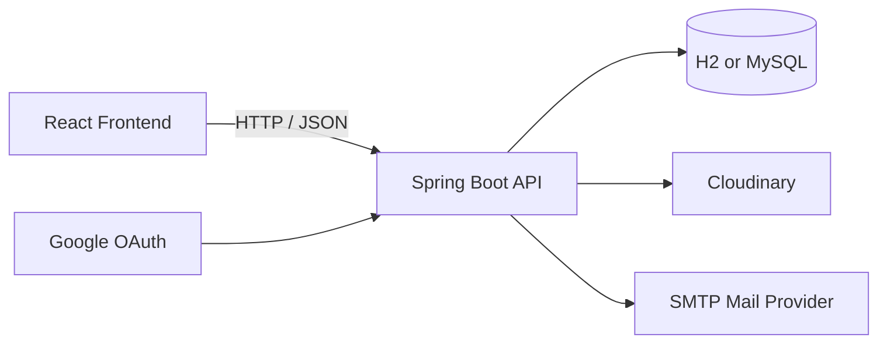

# Smart Campus Management System

Smart Campus Management System is a full-stack web application for managing campus resources, bookings, and incident tickets across three primary roles: users, admins, and technicians.

The project is split into:

- Backend: Spring Boot REST API with JWT and Google OAuth support
- Frontend: React + Vite single-page app for user/admin/technician workflows

## Table of Contents

1. Introduction
2. Core Modules
3. System Workflow
4. Tech Stack
5. Project Structure
6. Prerequisites
7. Environment Configuration
8. Setup and Run
9. API Endpoints
10. Role and Status Reference
11. Notes for Development

## Introduction

This application provides an integrated platform to:

- Register and authenticate users with email/password + OTP verification
- Support Google OAuth sign-in
- Manage campus resources (rooms, labs, equipment)
- Create and administer bookings with approval and rejection flows
- Create and process incident tickets with assignment, resolution, and comments
- Deliver in-app notifications and user notification preferences
- Manage users and roles from an admin panel

The frontend consumes the backend API and enforces role-aware page access. The backend enforces authorization via Spring Security and method-level role checks.

## Core Modules

### 1. Authentication and Account Management

- Registration with OTP verification:
	- Request OTP via registration endpoint
	- Verify OTP to activate account and receive JWT
- Email/password login with JWT response
- Google OAuth login flow with backend redirect to frontend
- Profile updates including optional password change
- Profile deletion

### 2. Resource Management

- Public resource browsing and filtering
- Resource details by ID
- Admin-only resource create/update/delete
- Multipart image upload support for resource media
- Resource dropdown endpoint for simplified selectors

### 3. Booking Management

- Users can create bookings for resources
- Users can list and manage their bookings
- Admins can:
	- View all bookings
	- Approve or reject requests
	- View analytics-ready booking lists (including cleared items)
	- Clear bookings from admin view

### 4. Incident Ticket Management

- Users and admins can create tickets with optional attachments
- Ticket visibility by role:
	- User: own tickets
	- Technician: assigned tickets
	- Admin: all tickets
- Admin can assign technician or reject ticket
- Admin/technician can resolve ticket
- Users can close or delete their tickets (according to authorization rules)
- Ticket comments can be added/updated/deleted by authenticated users

### 5. Notifications and Preferences

- Unread and full notification feeds for current user
- Mark notification as read
- Get/update notification preference settings

### 6. Admin User Management

- Admin-only user list
- Admin-only user creation
- Admin-only role updates
- Admin-only user deletion

## System Workflow

### High-Level Request Flow



### Authentication Workflow

1. User registers via /api/v1/auth/register.
2. Backend sends OTP email.
3. User verifies OTP via /api/v1/auth/register/verify-otp.
4. Backend returns token, expiry, and role metadata.
5. Frontend stores auth session in localStorage.
6. Protected requests include Authorization: Bearer <token>.

### Booking Workflow

1. User browses resources.
2. User submits booking request.
3. Booking defaults to PENDING.
4. Admin approves or rejects booking.
5. User sees updated booking status and reason if rejected.

### Ticket Workflow

1. User/admin creates incident ticket (optional attachments).
2. Admin assigns technician or rejects ticket.
3. Technician/admin resolves ticket.
4. User closes ticket after resolution.
5. Stakeholders can comment during lifecycle.

## Tech Stack

### Frontend

- React 19
- Vite 8
- Tailwind CSS 4
- React Toastify
- Recharts
- Lucide React, React Icons
- jsPDF + jspdf-autotable

### Backend

- Java 17
- Spring Boot 4.1.0-SNAPSHOT
- Spring Web MVC
- Spring Security
- Spring Data JPA
- Spring OAuth2 Client (Google)
- JWT (jjwt)
- Spring Mail
- Cloudinary SDK

### Data and Storage

- Default: H2 file database
- Optional: MySQL (runtime connector available)
- Cloudinary for image/file media storage

## Project Structure

```text
PAF-Project/
	backend/    # Spring Boot API
	frontend/   # React + Vite web application
```

Key backend packages:

- controller: REST endpoint layer
- service: business logic
- repository: data access
- entity: persistence models
- security: JWT, OAuth2, security config
- dto: request/response contracts

Key frontend folders:

- src/api: API client helpers
- src/pages: route-level page modules
- src/components: reusable UI blocks and dashboard sections
- src/utils: auth session, OAuth redirect handling, nav config

## Prerequisites

- Java 17+
- Node.js 18+ (Node.js 20 recommended)
- npm 9+
- Internet access for dependency download

Optional for production-like setup:

- MySQL 8+
- Cloudinary account
- Google OAuth credentials
- SMTP credentials (for OTP email)

## Environment Configuration

Backend reads values from:

- JVM/application properties
- Optional .env file in project root or backend folder

Create either:

- PAF-Project/.env
- or PAF-Project/backend/.env

Suggested backend variables:

```env
# Database (defaults to local H2 file if omitted)
DB_URL=jdbc:h2:file:./data/smartcampus_db;MODE=MySQL;AUTO_SERVER=TRUE;DATABASE_TO_LOWER=TRUE
DB_USERNAME=root
DB_PASSWORD=1234

# Frontend/CORS
FRONTEND_ORIGIN=http://localhost:5173
FRONTEND_OAUTH_SUCCESS_URL=http://localhost:5173/
FRONTEND_OAUTH_FAILURE_URL=http://localhost:5173/login

# JWT
JWT_SECRET=replace-with-strong-secret-at-least-32-bytes
JWT_EXPIRATION_MINUTES=60
JWT_ISSUER=smart-campus

# Google OAuth (optional but required for Google login)
GOOGLE_CLIENT_ID=
GOOGLE_CLIENT_SECRET=

# Mail/OTP (required for registration OTP by email)
MAIL_HOST=smtp.gmail.com
MAIL_PORT=587
MAIL_USERNAME=
MAIL_PASSWORD=
MAIL_FROM=
MAIL_OTP_SUBJECT=UniPilot verification code

# Cloudinary (required for media upload flows)
CLOUDINARY_CLOUD_NAME=
CLOUDINARY_API_KEY=
CLOUDINARY_API_SECRET=
CLOUDINARY_FOLDER_ROOT=unipilot
```

Frontend variables (create PAF-Project/frontend/.env):

```env
VITE_API_BASE_URL=http://localhost:8080
```

## Setup and Run

## 1) Clone and enter project

```bash
git clone <your-repository-url>
cd PAF-Project
```

## 2) Start backend

From PAF-Project/backend:

Windows (PowerShell):

```powershell
.\mvnw.cmd spring-boot:run
```

macOS/Linux:

```bash
./mvnw spring-boot:run
```

Backend default URL: http://localhost:8080

## 3) Start frontend

From PAF-Project/frontend:

```bash
npm install
npm run dev
```

Frontend default URL: http://localhost:5173

## 4) Build production artifacts

Frontend:

```bash
npm run build
```

Backend (JAR):

Windows:

```powershell
.\mvnw.cmd clean package
```

macOS/Linux:

```bash
./mvnw clean package
```

## API Endpoints

Base backend URL: http://localhost:8080

Note:

- Endpoints with /api/v1/... are the primary versioned API.
- /api/resources and /api/bookings are currently non-versioned modules.
- Authorization is role-based and enforced by Spring Security.

### Authentication

- POST /api/v1/auth/register
- POST /api/v1/auth/register/verify-otp
- POST /api/v1/auth/login
- GET /oauth2/authorization/google

### User Profile

- PUT /api/v1/users/me
- DELETE /api/v1/users/me

### Resources

- GET /api/v1/resources
- GET /api/v1/resources/{resourceId}
- POST /api/v1/resources (ADMIN)
- PUT /api/v1/resources/{resourceId} (ADMIN)
- DELETE /api/v1/resources/{resourceId} (ADMIN)
- GET /api/resources (dropdown list helper)

### Uploads

- POST /api/v1/uploads/resources/{resourceId} (ADMIN)
- POST /api/v1/uploads/tickets/{ticketId}

### Bookings

- POST /api/bookings (USER)
- GET /api/bookings/my (USER)
- GET /api/bookings (ADMIN)
- GET /api/bookings/all (ADMIN)
- PUT /api/bookings/{id}/clear (ADMIN)
- PUT /api/bookings/{id}/approve (ADMIN)
- PUT /api/bookings/{id}/reject (ADMIN)
- PUT /api/bookings/{id} (USER)
- DELETE /api/bookings/{id} (USER or ADMIN)

### Incident Tickets

- POST /api/v1/tickets
- GET /api/v1/tickets/my
- GET /api/v1/tickets (ADMIN)
- GET /api/v1/tickets/assigned (TECHNICIAN)
- GET /api/v1/tickets/{ticketId}
- PUT /api/v1/tickets/{ticketId}/assign (ADMIN)
- PUT /api/v1/tickets/{ticketId}/reject (ADMIN)
- PUT /api/v1/tickets/{ticketId}/resolve (ADMIN or TECHNICIAN)
- PUT /api/v1/tickets/{ticketId}/close
- DELETE /api/v1/tickets/{ticketId} (USER)
- POST /api/v1/tickets/{ticketId}/comments
- PUT /api/v1/tickets/comments/{commentId}
- DELETE /api/v1/tickets/comments/{commentId}

### Notifications

- GET /api/v1/notifications/me
- GET /api/v1/notifications/me/all
- PATCH /api/v1/notifications/{notificationId}/read
- GET /api/v1/notifications/preferences/me
- PUT /api/v1/notifications/preferences/me

### Admin User Management

- GET /api/v1/admin/users (ADMIN)
- POST /api/v1/admin/users (ADMIN)
- PUT /api/v1/admin/users/{id}/role (ADMIN)
- DELETE /api/v1/admin/users/{id} (ADMIN)

## Role and Status Reference

### Roles

- USER
- ADMIN
- TECHNICIAN

### Booking Status

- PENDING
- APPROVED
- REJECTED
- CANCELLED

### Incident Ticket Status

- OPEN
- IN_PROGRESS
- RESOLVED
- CLOSED
- REJECTED

### Incident Ticket Priority

- LOW
- MEDIUM
- HIGH
- XHIGH

### Incident Ticket Category

- BOOKING
- RESOURCE

### Resource Type

- LECTURE_HALL
- LAB
- MEETING_ROOM
- EQUIPMENT

### Resource Status

- ACTIVE
- OUT_OF_SERVICE

### Equipment Category

- PROJECTOR
- SMART_BOARD
- SPEAKER
- MICROPHONE
- CAMERA
- OTHER

## Notes for Development

- Backend currently uses spring.jpa.hibernate.ddl-auto=update.
- Default local database is a file-based H2 DB under backend runtime path.
- CORS allowed origin defaults to http://localhost:5173 and is configurable.
- API base URL on frontend defaults to http://localhost:8080 if VITE_API_BASE_URL is not set.
- Sensitive values should be managed using environment variables in real deployments.